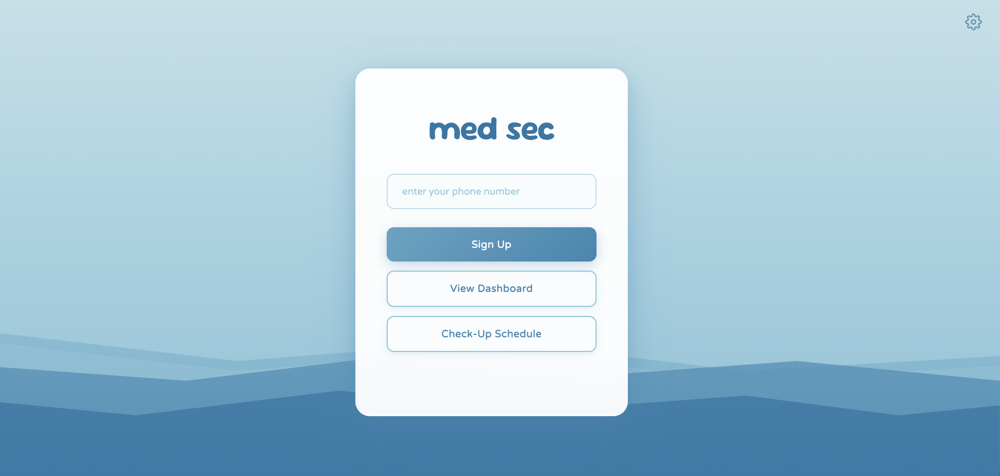

# MedSec (TreeHacks 2026)

Your AI-powered medical assistant! 

MedSec is an AI-powered medical assistnat that operates entirely over the phone.

Enter your number and it will call you, ask about your pain, and create a check-up schedule.

Long-term, MedSec will collect and analyze your symptoms. You'll read about your pain history, day-to-day health status, and any long-term patterns.

This project was made for TreeHacks 2026.

## Devpost: [devpost.com/software/th26](https://devpost.com/software/th26)



## Highlights

+ **Long-term symptom tracking** --- through personalized follow-ups
+ **Agentic scheduling pipeline** --- internally creates a check-in schedule based on your first meeting
+ **Live biomarker analysis** --- tracks shaky voice, pauses, tone, etc.
+ **Custom pain recalibration** --- adjusts for daily physical changes & long-term habituation
+ **Clean & intuitive UI** --- just add your number!

## Quick Start

1. **Clone the repository**
   ```bash
   git clone https://github.com/propadiene-1/TreeHacks-2026.git
   ```

2. **Install dependencies**
   ```bash
   npm install
   ```

3. **Set up API keys**

   + Visit [OpenAI](https://openai.com) and get your API key.
   + Visit [Chroma Cloud](https://docs.trychroma.com/cloud/getting-started) and get your API key.

4. **Set up Twilio**

   + Make a [Twilio account](https://login.twilio.com/u/signup?state=hKFo2SAxMnVyT0ptaS1DTzlSMmhBMzJmWl9CLWpPVHhFMzVEdqFur3VuaXZlcnNhbC1sb2dpbqN0aWTZIFBhNmEyYWcxZEVLUTAzZmNPcnpTV2pxcHhvV2ZIeS14o2NpZNkgTW05M1lTTDVSclpmNzdobUlKZFI3QktZYjZPOXV1cks) and follow [these instructions](https://help.twilio.com/articles/223180048-How-to-Add-and-Remove-a-Verified-Phone-Number-or-Caller-ID-with-Twilio) to add phone numbers. 
   + Add a source number which MedSec will use to call you (TWILIO_PHONE_NUMBER).
   + Add all client numbers that MedSec should call.

5. **Set up environment variables**

   Create a file called `.env` file in the root directory:

    ```env
   OPENAI_API_KEY=[YOUR API KEY]
   PORT=3000
   TWILIO_ACCOUNT_SID = [YOUR ACCOUNT SID]
   TWILIO_AUTH_TOKEN = [YOUR AUTH TOKEN]
   TWILIO_PHONE_NUMBER = [SOURCE PHONE NUMBER]
   CHROMA_API_KEY= [YOUR API KEY]
   CHROMA_TENANT= [YOUR TENANT CODE]
   SERVER_URL= [YOUR SERVER URL]
    ```

6. **Set up ngrok (instructions [here](http://ngrok.com/docs/getting-started)).**

   Start ngrok before running the app.

7. **Run the app**
    ```bash
    npm start
    ```

## Tech Stack

- **Backend**: Node.js, Express
- **Voice Processing**: Twilio Voice API with real-time speech-to-text
- **Natural Language**: OpenAI GPT-4o (conversational AI + function calling)
- **Vector DB**: ChromaDB (semantic search)
- **Scheduling**: node-cron with adaptive recurrence logic
- **Analytics**: Custom pain recalibration algorithm + biomarker analysis
- **Frontend**: HTML, JavaScript, CSS

## Project Structure

```
TreeHacks-2026/
├── public/                 # frontend
│   ├── index.html        # main page
│   │   dashboard.html        # user data
|   |   schedule.html       #schedule page
|   |   schedule.js         
│   │   script.js           # frontend functions
|   |   style.css           # UI
├── package.json            # dependencies
|   server.js               # backend logic
├── openai-calls.js         # api calls
|   pain-correction.js     # pain correction algorithm
├── .env                   # environment variables
└── README.md
```
## Authors
- Isita B.
- Ashita B.
- Nishka K.
- Aileen L.